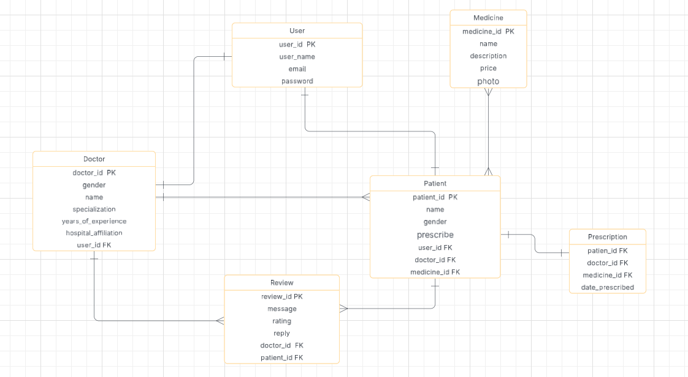

# 🏥 Health Consulting App – Backend
## 🌐 Project Description

The **Health Consulting App** is a full-stack web platform that enables seamless interaction between **doctors** and **patients** for online medical consultations. Developed using **React** (frontend) and **Django REST Framework** (backend), the app delivers a user-friendly interface with secure data handling and a role-specific experience.

### 👨‍⚕️ For Doctors:
- View and manage comments received from patients
- Reply to patient messages
- View ratings and feedback
- Prescribe medicines

### 🧑‍💼 For Patients:
- Search and view doctors' profiles
- Leave comments and ratings for doctors
- Edit or delete own comments
- Receive replies from doctors
- Browse and purchase available medicines

This platform aims to improve healthcare access by connecting users to trusted professionals, making communication, consultation, and prescriptions more efficient and digital-first.

## 📦 Repository Description
This repository contains the **backend** of the Health Consulting App built with **Python** and **Django REST Framework**.  
It handles authentication, business logic, API endpoints, and communication with the database.

---

## 🛠 Tech Stack

- Python
- Django
- PostgreSQL 
- Docker
- VS Code
- GitHub

---

## 🔗 Frontend Repository
[Health Consulting App – Frontend](https://github.com/Ahad-amj/frontend-health-consulting)

---

## 🌐 Link to Deployed Site
[Live App](http://127.0.0.1:8000/) 

---

## 🗂️ ERD Diagram

  

---

## 📚 API Routing Table

### 👤 User Endpoints

| Action   | Method | URL              | Description                              |
|----------|--------|------------------|------------------------------------------|
| Register | POST   | `/user/signup/`  | Register as a new user (Doctor/Patient)  |
| Login    | POST   | `/user/login/`   | User login                               |
| Logout   | POST   | `/user/logout/`  | User logout                              |

### 🩺 Doctor Endpoints

| Action           | Method | URL                        | Description                                 |
|------------------|--------|-----------------------------|---------------------------------------------|
| List Doctors     | GET    | `/doctors/`                | View all doctors                            |
| Doctor Detail    | GET    | `/doctors/<id>/`           | Doctor profile, comments, and ratings       |
| Update Profile   | PUT    | `/doctors/<id>/`           | Update own doctor profile                   |
| Delete Profile   | DELETE | `/doctors/<id>/`           | Deactivate doctor account (optional)        |

### 🧑‍⚕️ Patient Endpoints

| Action           | Method | URL                             | Description                              |
|------------------|--------|----------------------------------|------------------------------------------|
| List Patients    | GET    | `/patients/`                    | Admin access only                        |
| Patient Detail   | GET    | `/patients/<id>/`               | View patient profile                     |
| Update Profile   | PUT    | `/patients/<id>/`               | Update own profile                       |
| Delete Profile   | DELETE | `/patients/<id>/`               | Deactivate patient account               |
| Prescribe Meds   | POST   | `/patients/<id>/medicines/<med_id>/prescribe/` | Doctor prescribes meds to a patient |

### 💊 Medicine Endpoints

| Action         | Method | URL                     | Description                      |
|----------------|--------|--------------------------|----------------------------------|
| List Medicines | GET    | `/medicines/`           | View all available medicines     |
| Detail View    | GET    | `/medicines/<id>/`      | Get details of a medicine        |

### 📝 Review Endpoints

| Action               | Method | URL                              | Description                          |
|----------------------|--------|-----------------------------------|--------------------------------------|
| List Reviews         | GET    | `/doctors/<id>/reviews/`         | View all reviews for a doctor        |
| Add Review           | POST   | `/doctors/<id>/reviews/`         | Submit comment & rating              |
| Edit Review          | PUT    | `/reviews/<id>/`                 | Edit your own comment or rating      |
| Delete Review        | DELETE | `/reviews/<id>/`                 | Delete your own comment or rating    |
| Doctor Reply         | POST   | `/reviews/<id>/reply/`           | Doctor replies to a review           |

---

## 🚀 Installation Instructions (Docker)

## ❄️ IceBox Features

- Create a **medicine purchase API** with order management and payment integration (e.g., Stripe).
- Store **hospital location data** and add an endpoint to return the **nearest hospital** to a given patient using geolocation.
- Implement authentication using **JWT tokens** for better scalability.
- Add notification/email support for purchases and doctor replies.
- Add search/filter API endpoints for doctors and medicines.
- Introduce rate-limiting and request throttling to improve security.
